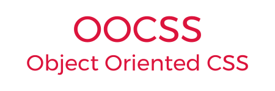

# OOCSS - CSS ORIENTADO A OBJETOS

> "Basicamente, um 'objeto' de CSS é um padrão visual repetitivo, que pode ser abstraído em um fragmento independente de HTML, CSS e possivelmente JavaScript. Esse objeto pode ser reutilizado em todo o site." - Nicole Sullivan

Orientação a objetos é um paradigma de programação que pode ser adaptado a desenvolvimento de CSS. O objetivo principal dessa abordagem é evitar repetição de código.

Essa metodologia, desenvolvida por Nicole Sullivan, define que é necessário olhar para as tags que compõe uma view HTML como objetos. Um bloco é um objeto. Um título é um objeto. Uma lista, um parágrafo, uma tabela também são objetos e como objetos eles devem receber classes que forneçam clareza sobre sua natureza. Em resumo, um objeto CSS é um padrão que pode se repetir no projeto e deve ser identificado por uma classe.

OOCSS enfatiza a separação de propriedades de estrutura (como os objetos estão dispostos) e aparência (como é o visual). Tratar os objetos dessa maneira permite ao desenvolvedor uma nova perspectiva para organizar classes CSS apenas com as regras necessárias e pertinentes a cada seletor.

## Princípios

OOCSS possui dois princípios fundamentais:

  1. **Separação entre estrutura e aparência**
     - Utilização de classes separadas para estilizar as características estruturais e visuais dos objetos.
     - A distinção entre características estruturais e visuais melhora a semântica das classes e torna o código mais reutilizável e escalável.
     - As regras estruturais são aquelas que definem posicionamento, comportamento e modelo de caixa.
     - As regras visuais são aquelas que definem formatação de texto, bordas, pintura, sombreamento e animações.

  2. **Independência entre contêiner em relação ao conteúdo**
     - Qualquer componente deve manter suas características independente do contêiner onde esteja inserido.

## Benefícios

Quando esses princípios são bem aplicados alguns benefícios se tornam evidentes.

  - Código mais legível e enxuto que resulta em arquivos menores e, por consequência, tráfico menor ao realizar o download da folha de estilos.
  - Redução de complexidade e especificidade pois o reuso de código significa que um novo objeto foi estilizado com zero linhas de código.
  - Seletores mais eficientes que exigem menos trabalho do renderizador de CSS de cada navegador (menos _reflows_ e _repaints_).

## Contratempos

  - Suporte complexo: quando é necessário alterar o estilo de um elemento em particular geralmente a alteração não afeta apenas um elemento porque as classes são compartilhadas entre vários componentes.
  - Algumas vezes é necessário adicionar classes extras à marcação HTML.
  - Sem uma quantidade razoável de padrões visuais repetitivos, a separação de códigos de estrutura e estilo visual parece desnecessária.
  - A metodologia oferece apenas recomendações abstratas e não há regras específicas.

## Recomendações

  - O _nesting_ de seletores deve ser evitado de forma a manter a independência entre eles. Radicalismo não é necessário, _nesting_ pode ser utilizado com moderação como modificadores em casos muito específicos.
  - Classes nomeadas com nomes baseados em conteúdo ou funcionalidade são de difícil reuso. Nomes de classes devem refletir o significado do objeto.
  - Nomes de classes devem ser escritos em **camelCase** e não devem conter hifenização. Essa regra pode ser desconsiderada se OOCSS for utilizado em conjunto com outras metodologias como SMACSS ou BEM.

A seguir, recomendações que não são exclusivas da metodologia OOCSS, todavia devem ser observadas em qualquer projeto envolvendo CSS.

  - Evitar IDs;
  - Evitar seletores descendentes (Ex.: `.toolbar h1`);
  - Evitar seletores qualificados (Ex.: `h1.title`);
  - Evitar uso de `!important`;
  - Checar CSS com um bom _linter_.

## Exemplos

### Separação entre estrutura e aparência

```html
<!-- RUIM -->
<div class="notice-to-user">
  <span>Conteúdo da mensagem.</span>
</div>

<style>
.notice-to-user {
  position: fixed;
  top: 2.4rem;
  right: 3.6rem;
  padding: .6rem 2.4rem;
  font-size: 1.6rem;
  line-height: 1.25;
  border-radius: .6rem;
  background-color: MediumSeaGreen;
  color: WhiteSmoke;
  /* Essa classe não deveria formatar texto tampouco conter pintura da caixa */
}
</style>

<!-- BOM -->
<div class="notice-to-user box-positive">
  <span>Conteúdo da mensagem.</span>
</div>

<style>
.notice-to-user {
  position: fixed;
  top: 2.4rem;
  right: 3.6rem;
  padding: .6rem 2.4rem;
  border-radius: .6rem;
  /* Modelagem básica da caixa */
}
.notice-to-user span {
  font-size: 1.6rem;
  line-height: 1.25;
  /* Formatação de texto pertence ao objeto de texto */
}
.box-positive {
  background-color: MediumSeaGreen;
  color: WhiteSmoke;
  /* Estilos visuais separados da modelagem da caixa */
}
</style>
```

### Independência entre contêiner em relação ao conteúdo

```html
<!-- RUIM -->
<header class="toolbar">
  <h1>OOCSS</h1>
</header>
<article class="model-post">
  <h2>Olá, OOCSS!</h2>
</article>

<style>
.toolbar h1,
.model-post h2 {
  font-weight: 300;
  font-size: 2.4rem;
  line-height: 1.5;
  /* A formatação dos elementos de cabeçalho dependem de seus contêineres */
}
.toolbar h1 {
  color: WhiteSmoke;
}
</style>

<!-- BOM -->
<header class="toolbar">
  <h1 class="heading">OOCSS</h1>
</header>
<article class="model-post">
  <h2 class="heading">Olá, OOCSS!</h2>
</article>

<style>
.heading {
  font-weight: 300;
  font-size: 2.4rem;
  line-height: 1.5;
  /* Modelo de classe que pode ser utilizada em qualquer contêiner */
}
.toolbar .heading {
  color: WhiteSmoke;
  /* Nesting utilizado como modificador */
}
</style>
```

## Referências

 - [https://github.com/stubbornella/oocss/wiki](https://github.com/stubbornella/oocss/wiki)
